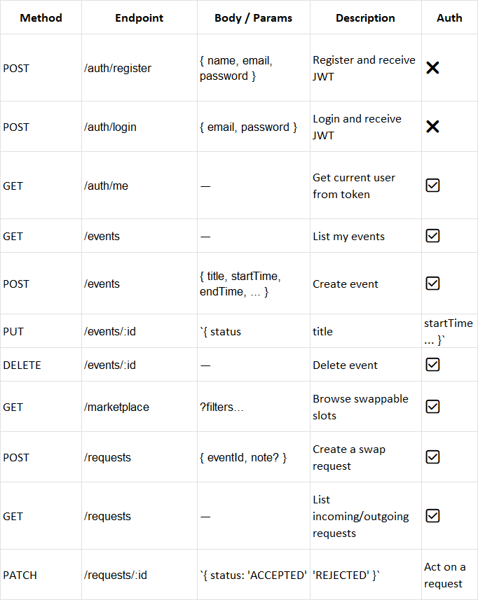

# SlotSwapper

A lightweight web app to manage your calendar, mark slots as swappable, browse a marketplace, and handle swap requests — powered by a JWT-authenticated React (Vite) frontend and a RESTful Node/Express API.

---

## Overview

- **Auth:** JWT tokens stored in `localStorage`. Navbar updates instantly via a custom `authChanged` event (no full reload).
- **Routing:** React Router v6 with a `ProtectedRoute` wrapper for `/dashboard`, `/marketplace`, and `/requests`.
- **State/UX:**
  - Home page (public): modern hero + features; shows **Login/Register** when logged out, **Go to My Calendar** when logged in.
  - Dashboard: list of events with status (BUSY / SWAPPABLE / SWAP_PENDING), create via `EventForm`, toggle BUSY↔SWAPPABLE, and (optionally) update/delete.
- **HTTP:** Axios instance with an interceptor to attach `Authorization: Bearer <token>`.
- **Styling:** Tailwind CSS with subtle animations, gradients, and responsive layout.
- **Design Choices:**
  - Kept auth **simple and explicit** (no Firebase) with localStorage + an app-wide event to keep UI reactive.
  - Clean, minimal, SaaS-like UI (neutral colors, generous spacing, subtle shadows).
  - Clear separation: pages (`/pages`), shared UI/components (`/components`), API client (`/utils/api.js`).

---

## Getting Started (Local)

> Prereqs: Node 18+, npm (or pnpm/yarn)

### 1) Clone & install
```bash
git clone <your-repo-url>
cd slotswapper-frontend
npm install



Frontend 
src/
├── components/
│   ├── EventForm.jsx      # For creating/editing events
│   └── ProtectedRoute.jsx # For protecting routes
├── pages/
│   ├── LoginPage.jsx
│   ├── RegisterPage.jsx
│   ├── Dashboard.jsx      
│   ├── Marketplace.jsx
│   └── Requests.jsx
├── utils/
│   └── api.js             # Centralized API calls (Axios setup)
├── App.jsx                # Router setup
└── main.jsx